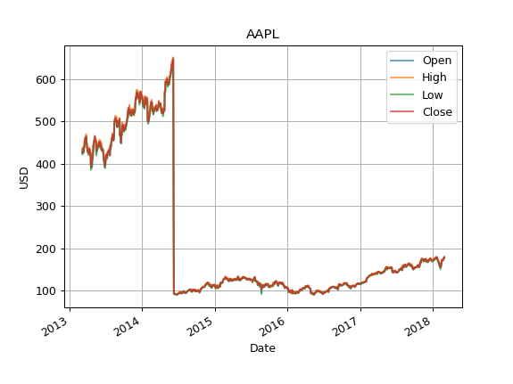

# Machine Learning Engineer Nanodegree
## Capstone Project
April 23rd, 2018

Michael Løiten

## I. Definition

### Project Overview

In this project we try to predict the closing value (adjusted for 
[stock split](https://classroom.udacity.com/courses/ud501/lessons/4442578629/concepts/45792868240923)
and
[dividends](https://classroom.udacity.com/courses/ud501/lessons/4442578629/concepts/44273516340923))
based on adjusted closing values in the past.

> **Disclaimer:** In this project we do not seek to make the best possible 
prediction, rather, it is an exploratory exercise in how machine learning can
 be used for predicting the future based on information about the past. 

Predicting the closing value of stocks is interesting for several reasons:

1. The time series are sequential, so techniques in machine learning like 
randomization of the data and cross-validation can not be used in a straight 
forward manner.
2. Stocks are notoriously [non](https://www.investopedia.com/articles/trading/07/stationary.asp)
[-stationary](https://en.wikipedia.org/wiki/Stationary_process).
This means that both the measures changes with time, and the stochastic rule 
underlying their realization. 
The consequence is that traditional statistical techniques must be used with
care when analysing the data.
This also means that we need to take care when scaling the data, as 
several techniques uses the mean and standard deviation to scale the numbers.
3. Although we are predicting the stock market here, the *techniques* for 
forecasting can be applied to any forecasting problem, like forecasting 
weather, sales, populations etc. 
Note though, that the *findings* about the models and hyper parameters may not 
be directly transferable to a different forecasting problem.
4. The [efficient-market hypothesis](https://en.wikipedia.org/wiki/Efficient-market_hypothesis), 
or simply [EMH](https://www.investopedia.com/terms/e/efficientmarkethypothesis.asp),
states that stocks are already properly priced and reflects all available 
information.
Effectively, this means that "you can't beat the market".
More specifically it states that you cannot make any profit from any trading 
strategies.
Although there are several forms of this statement, even the weak form states 
that "Future prices cannot be predicted by analyzing prices from the past", 
and that
"[Technical analysis](https://en.wikipedia.org/wiki/Technical_analysis) 
techniques will not be able to consistently produce 
excess returns, though some forms of 
[fundamental analysis](https://en.wikipedia.org/wiki/Fundamental_analysis)
may still provide excess returns."
Stated differently, if we name our random variable $\phi$, the 
EMH states that $p(\phi_{t+k} | \phi_{t}) = p(\phi_{t+k}) \quad \forall k$ and
that $\operatorname{Cov}(\phi_{t+k} | \phi_{t})=0$, i.e. that all samples in 
the time series are independent (see also [these slides](http://www.ulb.ac.be/di/map/gbonte/ftp/time_ser.pdf)
for a nice introduction to the topic).
A weaker statement would be that stock prices act like a 
[random-walk](https://machinelearningmastery.com/gentle-introduction-random-walk-times-series-forecasting-python/).
In that case, the next time step is dependent on the previous time step which
gives the times series some degree of predictability.

The idea of using machine learning for trading is far from new, and both 

have been studying the topic.
There are several sources out there which have used similar approaches to 
predict the stock prices using machine learning.
There are papers by
[academics](https://www.sciencedirect.com/science/article/pii/S0957417405003015) 
and
[students](http://citeseerx.ist.psu.edu/viewdoc/download?doi=10.1.1.83.5299&rep=rep1&type=pdf);
[various](https://lilianweng.github.io/lil-log/2017/07/08/predict-stock-prices-using-RNN-part-1.html)
[blogs](https://medium.com/machine-learning-world/tagged/finance);
[kaggle notebooks](https://www.kaggle.com/pablocastilla/predict-stock-prices-with-lstm);
[previous](https://github.com/jessicayung/machine-learning-nd/tree/master/p5-capstone)
ML nanodegree
[graduates](https://github.com/Rajat-dhyani/Stock-Price-Predictor);
even vlogs describing how to use
[support vector regression](https://www.youtube.com/watch?v=SSu00IRRraY),
[lstm](https://www.youtube.com/watch?v=ftMq5ps503w&feature=youtu.be)
and
[sentiment analysis](https://www.youtube.com/watch?v=JuLCL3wCEAk)
for stock prediction.

Daily stock data has until recently been readily and freely available.
At the time of writing, the situation is somewhat changed, after Yahoo! Finance 
deprecated their APIs in late 2017, several of the distributors which 
provided daily stock data for free has deprecated their APIs. Latest Quandl 
stated

> As of April 11, 2018 this data feed is no longer actively supported by the 
Quandl community. We will continue to host this data feed on Quandl, but we do 
not recommend using it for investment or analysis.

Therefore, the data used in this project has been stored in the `data/` 
directory of the repository. More information about the origin of the 
downloaded data can be found under `proposal/capstone_proposal` under the 
section *Datasets and Inputs*.

In this project we have used the daily stock data containing information 
about opening price, highest traded price, lowest traded price, closing price, 
volume sold and adjusted closing value (ohlcva) for the 50 stocks with the 
highest weights in the S&P500 portfolio together with ^GSPC itself as of 6th
of March 2018.

### Problem Statement

In this project we would like to build estimators based on the k-nearest 
neighbors (kNN) and long short term memory (LSTM) algorithms and see if they 
can outperform the simple predictions made by latest day, random gaussian and
linear regression algorithms in the task of predicting the adjusted closing 
price of the stocks.
We will assume that what matters the most is the estimators ability to 
estimate the closing value 7, 14 and 28 days ahead, and that each prediction 
is of equal importance.
The prediction will be done in an rolling matter for all models except the 
LSTM models. That is, we

1. Fit the data up until day $x$
2. Do the predictions of day $y_1$, $y_2$ and $y_3$, at day $x$
3. Add the true data of day $x+1$, refit the models and predict for day 
$y_1+1$, $y_2+1$ and $y_3+1$
4. Add the true data of day $x+2$, refit the models and predict for day 
$y_1+2$, $y_2+2$ and $y_3+2$, and so on

We will also assume that the training time of the models is crucial, which is
why we are content with a normal prediction for the LSTM models. I.e., we

1. Fit the data on the training set
2. Make predictions of $y_1$, $y_2$ and $y_3$ on the test set.

> **Note:** We will fit one model (with the same hyper parameters) for each 
stock we are predicting for. I.e. we will not use model fitted on stock A to 
make predictions on stock B.

We will use the ochlva data Standard and Poor's 500 (S&P500) portfolio as of 
2018-03-06.

The number of ways to investigate and solve this problem is enormous, so in 
order to limit the scope we:

* Only look at four stocks: The `^GSPC`, `AAPL` (which had the highest weight
in the S&P 500 portfolio), `CMCSA` (which was the 25th highest weighted stock
in the S&P 500 portfolio) and `GILD` (which was the 50th highest weighted stock
in the S&P 500 portfolio)
* Only use the data for one stock at the time
* Only use the data from the adjusted close

That being said, it would be very interesting to include more of the ochlv 
data and even the information about other stocks in the prediction after 
doing a proper feature analysis (like looking at correlations, doing a PCA 
analysis etc.).

The strategy to solve the problem can be outlined as follows 
(for a more detailed description, see section
[III. Methodolody](#iii.-methodology)):

1. Investigate the predictive capability of the "simple models" 
(`latest_day`, `random_gaussian` and `linear_regression`). 
The notebooks for investigation can be found in `notebooks/1.*.ipynb`.
2. Investigate the predictive capability of the "advanced models" 
(`knn` and `lstm`). 
The notebooks for investigation can be found in `notebooks/2.*.ipynb`.
3. Tune the features and hyper parameters for the "advanced models" one by one.
Note that this could be done by performing a 
[grid search](http://scikit-learn.org/stable/modules/grid_search.html).
However, as we are interested in the trends, and since we are using a 
non-standard metric (see the [metrics](#metrics) section), we will search the 
parameters one by one, well aware of the fact that there may be combinations 
of the hyper parameters that potentially could give better predictions.
The notebooks for investigation can be found in `notebooks/3.*.ipynb`.

For each analysis we will for each stock investigated:

1. Read the data
2. Clean the data
3. Extract the adjusted close feature
4. Create the targets from the adjusted close, by shifting them by $t$ days 
towards the future 
(note that the $t$ latest observation would be without a target value)
5. (Optional) Make more features from the adjusted close by shifting them $u$
days towards the past
(note that the $s$ first observations would be without a target value)
6. (Optional) Scale the data
7. Split the data into a training set and a test set, or a training set, 
validation set and test set if we are tuning the hyper parameters
8. Perform a rolling or normal prediction.
9. (Optional) Rescale the data

### Metrics

As stated in the [problem statement](#problem-statement) we assume that the 
important factor when for example making a trading decision is the predicted 
value 7, 14 and 28 days ahead, and that each of these prediction is of equal
importance.
We must find a proper metric to address this problem.
We could have said that a prediction is good if it on average mispredicts the
closing value by less than $5 \%$.
However, if we look at the stocks we try to predict, we see that the stocks 
varies far less than $5 \%$ on the course of 28 days.
Instead, we could have used the mean squared error (MSE) of the test set to 
give an indication of how good the prediction is.
Using the positive square root of the MSE (RMSE) can be beneficial in order to 
make the order of the error easier comparable to the price by cancelling the 
effect of squaring.
However, as the absolute value of the stocks are quite different (especially 
when comparing `^GSPC` with the other stocks), the RMSE is a bad metric when 
comparing across different stocks,
Therefore, we will be using a form of normalized mean squared error 
([NMRSE](https://en.wikipedia.org/wiki/Root-mean-square_deviation#Normalized_root-mean-square_deviation))
defined by
 
$$
\frac{\sqrt{\frac{\sum _{i=1}^{n}({\hat {y}}_{i}-y_{i})^{2}}{n}}}
{y_{\max} - y_{\min}}
$$

to assess the error.

## II. Analysis

### Data Exploration
In section, we will present the findings from `notebooks/0-data_analysis.ipynb`. 

As noted above, we will focus on the four stocks 

* `^GSPC` - Standard and Poor 500 portfolio
* `AAPL` - Apple Inc.
* `CMCSA` - Comcast corporation
* `GILD` - Gilead Sciences, Inc.

The adjusted closing value of the stocks (which we will take up the main focus 
in this project) can be summarized in the following table:

| Stock | Samples | Start date | End date   | NaNs | Mean        | Max         | Min         | Std        | Q1          | Q2          | Q3          |
|-------|---------|------------|------------|------|-------------|-------------|-------------|------------|-------------|-------------|-------------|
| ^GSPC | 1260    | 2013-03-07 | 2018-03-07 | 0    | 2079.750175 | 2872.870117 | 1541.609985 | 286.663626 | 1884.517517 | 2065.594971 | 2206.597473 |
| AAPL  | 1254    | 2013-03-06 | 2018-02-28 | 0    | 106.716004  | 179.260000  | 50.928800   | 32.229902  | 85.194266   | 106.182039  | 122.349196  |
| CMCSA | 1258    | 2013-03-06 | 2018-03-06 | 0    | 29.283641   | 42.990000   | 18.031155   | 6.269263   | 24.920172   | 28.271251   | 33.938108   |
| GILD  | 1259    | 2013-03-06 | 2018-03-06 | 0    | 79.645139   | 115.929959  | 41.946136   | 16.337412  | 69.417169   | 77.871612   | 94.513256   |

From the table, we can observe that:

1. The number of samples are almost the same, indicating that some trade days 
are missing for some of the stocks
2. There are no NaNs or 0s present
3. ^GSPC has values roughly one order of magnitude larger than the rest of the 
stocks

Note that the mean and standard deviation are the sample mean and standard 
deviation.
I.e. it does not represent the true mean and standard deviation, at least not 
if the process is non-stationary.

Also note that there are $1826$ days between 2013-03-07 and 2018-03-07.
The 1260 days reflects the fact that there are no trading during week-ends and
bank holidays. 
Also, if we were looking at smaller stocks, they could have "missing" data 
simply from the fact that no one was trading those stocks on the given day.

Visual inspection (see [Exploratory Visualization](#exploratory-visualization))
shows no sign of outliers in terms of erroneous data in the adjusted close 
values;
one example of such error could be a single day which has 10 times higher
closing value due to a decimal error arising from manual typing of the data.

Further we can clearly observe that the full time series contain clear 
growing and decaying trend in the range we are observing. 
By performing a stationarity test (similar to the one performed 
[here](https://machinelearningmastery.com/time-series-data-stationary-python/))
we will investigate if the test set of `CMCSA`, which appears to have the least 
linear trend, is indeed non-stationary.

 We will use the
[Augmented Dickey-Fuller](https://en.wikipedia.org/wiki/Augmented_Dickey%E2%80%93Fuller_test)
test to test the probability that the time series contain a unit root and 
thereby is [trend-stationary](https://en.wikipedia.org/wiki/Trend_stationary),
i.e. if the trend is removed, then the resulting data is stationary.
If the time series is trend-stationary it is at least not stationary.
The hypotheses are:

* Null hypothesis: The series are non-stationary (i.e. there exist an time 
dependent trend)
* Alternative hypothesis: The series is stationary (i.e. no trend exist)

We've set the rejection hypothesis threshold of the p-value to  55 , meaning 
that we reject the null hypothesis (the series are stationary) if the p-value
is less than or equal to $0.05$.

We found that since $p > 0.05$ there was no evidence to reject the null 
hypothesis.
In other words, the time series is probably non-stationary.

### Exploratory Visualization

In section, we will present more findings from
`notebooks/0-data_analysis.ipynb`. 

In order to justify our choice of `Adj. Close` as the sole variable we will 
create the data set from we will perform some visual inspections on the 
features contained in the `.csv` files in the `data/` directory.

If we for example look at the ochl features of the `AAPL` stock (the rest can
 be found in `notebooks/0-data_analysis.ipynb`) shown below

 
We observe that overall, the ochl values follow each other to a high degree.
It  is important to note that they are not exactly the same, and in fact, how
the open, high and low aligns with the closing value can give important hints 
about the closing value the following day. 
The sudden drop is due to a stock split (which is accounted for in the 
adjusted close price).

These features can be compared with the plot of the volume data given below

We observe that the volume does not follow the same trend as the ochl data, and 
has far less structure. 
Note that the ^GSPC volume has been divided by 100 to make it easier to visually
compare the results.

As the ochl features are quite similar, and as the volume data contain less 
structure we choose (in order to limit the scope) to only look at the 
adjusted close values (shown below), as these contain strong structures and are 
likely to contain data needed for accurate prediction. 

### Algorithms and Techniques

In this project we will use some quite different techniques in order to try 
to estimate the closing value, and we will here present each one briefly.

In order to make the benchmarking tests we will use the following techniques:

* *Last day prediction (custom made)*: 
This estimator simply uses the current value to make the predictions.
For example, assume that at day $d$ the closing value is $y$, then the 
estimator would predict a closing value of $y$ for the days $d+7$, $d+14$ and
$d+28$.
The estimator is very simple, and has the potential to yield great results (at
least in the case where the closing value changes minimally).
The fitting routine only looks at the last value of the data, and stores this
or these values in a variable.
In the prediction phase, the stored value(s) will be set to the predicted value.
This estimator has no hyper parameters to tune.

* *Random gaussian (custom made)*: 
It's often stated random guessing, or even using
[monkeys](https://www.forbes.com/sites/rickferri/2012/12/20/any-monkey-can-beat-the-market/#5f10485a630a)
for stock trading can outperform professional humans.
Having no monkeys at hand, it easier to implement a random number generator 
to do the stock prediction.
This predictor will store the mean and the standard deviation of the training 
data in the fitting step, and use a gaussian random number generator with 
using the means and standard deviations from the fitting step in order to 
make predictions.
Note that as the processes are non-stationary, the mean and standard 
deviation will change as time evolves.
Neither this estimator has any hyper parameters to tune.

* *Linear regression (from the `sklearn` package)*:
This is considered to be the simplest of the linear regressors.
It is using the
[ordinary least squares](http://scikit-learn.org/stable/modules/linear_model.html#ordinary-least-squares) 
during fitting.
This will give the coefficients $a$ and $b$ in the linear equation $y=ax+b$ 
which will be used when predicting $y$ based on the input $x$.
Although the class have some 
[input parameters](http://scikit-learn.org/stable/modules/generated/sklearn.linear_model.LinearRegression.html#sklearn.linear_model.LinearRegression)
for the constructor, we would not usually define these as tunable hyper 
parameters for the model

For trying to predict the closing value we will use the following techniques:

* *k-nearest neighbor regression (from the `sklearn` package)*:
Also this is a quite simple model, but often yields good results despite its 
simplicity.
Even sophisticated software like
[QuantDesk](https://classroom.udacity.com/courses/ud501/lessons/4684695874/concepts/46403887880923)
are using kNN.
The fitting phase just uploads the available data to a storage location (like
the local memory or a database).
When predicting, the algorithm will find the k nearest neighbors (according 
to a distance metric) and predict the new value based on the mean of these.
The algorithm has at least
[some](http://scikit-learn.org/stable/modules/generated/sklearn.neighbors.KNeighborsRegressor.html#sklearn.neighbors.KNeighborsRegressor)
hyper parameters to play around with.
We can choose whether the mean should be weighted by for example distance or 
not, what metric to use for the calculation of distance and last but not 
least, the number of neighbors to take into account.
 
* *A Long Short Time Memory Recurring Neural Network (from the `keras` 
package, modified for our needs)*: 
The Long Short Time Memory (LSTM) neural network is a type of recurring 
neural network (RNN), which means that output of one of the 
[recurrences](https://www.youtube.com/watch?v=UNmqTiOnRfg) in 
the neural network serves as the input for the next one, like explained
[here](https://classroom.udacity.com/courses/ud730/lessons/6378983156/concepts/65523553300923).
A nice introduction to LSTM can be found in this
[blog](http://colah.github.io/posts/2015-08-Understanding-LSTMs/).
Although figuring out how the input to this machinery can be
[mind boggling](https://machinelearningmastery.com/reshape-input-data-long-short-term-memory-networks-keras/)
at first, all we need to do is to reshape our data to a 3-dimensional array\ 
where the dimensions represents
`[samples, time steps, features]`, where the `time step` dimension tells the 
LSTM how many
[times](https://github.com/keras-team/keras/issues/2045) 
the 
[recurrence should occur](https://stats.stackexchange.com/questions/288404/how-does-keras-generate-an-lstm-layer-whats-the-dimensionality).
The LSTM overcomes the vanishing gradient problem found in RNNs by having 
gates in each cell (equivalent to nodes in traditional neural 
network) which determines what should be kept in memory, and what should be 
forgotten, and is therefore very well suited for time series forecasting.
The LSTM learns the weights of the gates and the cells in the fitting phase 
and uses these in the prediction phase.
The hyper parameter tuning can be quite extensive, so we have in this project
limited the hyper parameter tuning to epochs, batch size, drop out rates, 
number of cells in the first layer, number of cells in the second layer and 
the number of time steps.

### Benchmark

The calculations of the benchmarks can be found in `notebooks/1.*.ipynb`.
We use the results of the simple algorithms above to get a feeling with how 
well we can perform with the simplest tools in the toolbox.
If one of the more advanced methods is only slightly better than these 
results, one should consider if it is worth the cost to use a more complex 
model.

By using the rolling prediction technique described in the
[Problem Statement](#problem-statement)
and the metric described in [Metrics](#metrics), we end up with the following
scores (the complete table with all the results can be found in the
[Justification](#justification) section)

| Stock | Last day | Random Gaussian | Linear regression |
|-------|----------|-----------------|-------------------|
| ^GSPC | 7.01     | 577.33          | 6.15              |
| AAPL  | 1.50     | 96.01           | 1.34              |
| CMCSA | 0.51     | 18.11           | 0.48              |
| GILD  | 0.94     | 15.55           | 0.76              |
| Sum   | 9.95     | 706.99          | 8.72              |

## III. Methodology

> **Note:** All classes and functions has been extensively documented in the 
source code, and more details can be found in the documentation.

### Data Preprocessing

Before the models can be used, the data needs to be preprocessed.
Preprocessing is firstly done when reading the data by using the `OCHLVAData`
class in `data_preparation/ochlva_data.py`.
When cleaning the data, the class makes sure that only dates present in 
`^GSPC` is considered, and if any `NaN`s are detected, they will be filled by 
first running a forward fill (setting missing data to the date with previous 
value), then by running a backwards fill (setting remaining missing data in 
the past to the nearest value in relative future).

The targets are then being created from the time series by using the 
`target_generator` found in `utils/column_modifiers.py`.
The targets are simply the time series under consideration shifted by the 
number of days we would like to predict for.
This means that the last observation will contain `NaN`s as we do not know 
the future value, and these `NaN`s are removed before using the data in the 
models.

When predicting using the KNN algorithm we are also generating features with 
the `feature_generator` of `utils/column_modifiers.py` by shifting the time 
series under consideration backwards in time.
This means that we will generate `NaN`s for the first observations in the 
time series, and also these `NaN`s are removed before using the data in the 
models.

For predictions with the LSTM models we need to create a 3-dimensional array.
The dimensions represents `[samples, time steps, features]`.
After reading the data from file and generating targets (and possibly 
features), the dimension of the data set is on the form `[samples, features]`.
We therefore create a `time step` dimension in `prepare_input` 
in `estimators/lstm.py`, which tells the LSTM how many
[times](https://github.com/keras-team/keras/issues/2045) 
the 
[recurrence should occur](https://stats.stackexchange.com/questions/288404/how-does-keras-generate-an-lstm-layer-whats-the-dimensionality).

As seen from `notebooks/2.2.1-lstm_prediction.ipynb`, the LSTM performs quite
poorly for unscaled features as it is trying to predict numbers far outside 
of the range.
If we were to predict only the closing price the next day we could have 
subtracted the value of the previous day to the current day, and 
thereby detrended the series.
However, in this project we aim to predict the adjusted close value 
7, 14 and 28 days ahead.
Even if we had successfully predicted the new target, we would not 
be able to do the back transformation which would depend on the values 6 days
ahead, 13 days ahead and 27 days ahead, which again would depend on the 
values 5 days ahead an so on.
In other words, we would need a prediction all the way until the last 
prediction day if we wanted to back transform to the adjusted close. 
Instead, we will scale the features by using the `StockMinMax.transform` 
found in `utils/transformations.py`.
The transformation reads

$$
x' = (x - x_{\min})/(x_{\max} - x_{\min})
$$

and the back transformation reads

$$
x = x'(x_{\max} - x_{\min}) + x_{\min}.
$$

It is important when scaling the features that we do not leak information 
from the unseen test set into the training and validation set.
In other words, the `max` and `min` in the above formulas refers to the 
maximum and minimum of the training set.
This can be problematic in the case where the test set deviates significantly
from the training set.
However, although the test sets deviates some form the training set in our 
examples, it's still within the range where the LSTM models can make 
meaningful predictions.

### Implementation
 
Although the code is well documented in the code, we will in this section 
provide some documentation of the "big picture" implementation.

In order to read the data from the files, an `OCHLVAData` class has been 
provided in `data_preparation/ochlva_data.py`.
This class handles everything related to the data sets.
In other words, it contains copy of the raw data of the stocks, the cleaned 
data of the stocks (where `NaN`s and bad dates have been removed) and 
transformed data (for example where some features have been added or removed).
By abstracting the handling of the data it is easier to loop over the stocks 
one by one for model fitting and prediction.

The estimators used in this project are found in the `estimators` directory 
if they are not already implemented in `sklearn`.
The estimators inherits from the `sklearn` regressors so that they in 
principle can be used in a `sklearn` pipeline.
Also, as the estimators shares the same member functions it is easier to 
reuse the code.
In the case of the LSTM estimator, the architecture of the net has been put 
as input parameters in the constructor so that it can be used in the same way
other `sklearn` objects treat hyper parameters.

In principle we could have looped over all regressors in a notebook, and 
shown the result, but the results from different regressors have been separated
to different notebooks in order to get a better overview.

The notebooks for the unoptimized models found in `notebooks/2.*.ipynb` are 
quite similar those for obtaining the benchmarks in `notebooks/1.*.ipynb`.
The process contains the following steps:

1. Read the different stock data from the files
2. Remove all features except `Adj. Close`
3. Generate the targets from the `Adj. Close`
4. Initialize the regressor
5. Loop through the stocks
    1. Split into a training and test set
    2. Make either a rolling or a normal prediction (found in 
    `estimators/predictions.py`)
    3. Calculate the score from the predictions

The result of the basic kNN prediction can be seen below for `^GSPC`

As mentioned, the unscaled LSTM predictions perform quite poorly as seen for 
`^GSPC` in the figure below

However, the predictions are not so bleak when we scale as seen below

A summary of the score of all the unoptimized predictions can be seen in the 
table below.

> **Note:** As training LSTM models are quite computationally heavy, all the 
predictions with LSTM in this project has been performed with a "normal" 
prediction.
One should therefore compare the scores between the different models with care.

| Stock | knn (unoptimized) | lstm (unoptimized, unscaled) | lstm (unoptimized, scaled) |
|-------|-------------------|------------------------------|----------------------------|
| ^GSPC | 2.38              | 11827.14                     | 148.83                     |
| AAPL  | 0.99              | 503.91                       | 7.59                       |
| CMCSA | 0.33              | 23.31                        | 0.59                       |
| GILD  | 0.88              | 42.67                        | 0.75                       |
| Sum   | 4.58              | 12397.03                     | 157.77                     |

### Refinement

We will now investigate whether we can improve the models to yield better 
results than those obtained in [Implementation](#implementation).
In order to that we will tune the hyper parameters of the two models.
For the kNN estimator this means tuning:

1. The number of features
2. The number of nearest neighbors

For the LSTM estimator this means tuning:

1. The number of epochs
2. The batch size
3. The drop out rates
4. The number of cells (the equivalent to number of neurons in a conventional
 neural network)
5. The number of cells in a secondary layer
6. The time steps

Note that we could have performed an entire 
[grid search](http://scikit-learn.org/stable/modules/grid_search.html#exhaustive-grid-search),
by doing some modifications to the scoring function and they way the 
predictions are made, this could be done with the estimators in `sklearn` as 
all of the estimators behaves as `sklearn` regression objects.
The full grid search however, can be computational heavy, and sometimes it 
suffices to know how the hyper parameters scales when changing one parameter 
at the time.
The drawback of the latter approach is of course that there may exist optima
arising from special combinations of the parameters which are different than 
the optima for the individual parameters.
Nevertheless we will go for the last approach in this project.

When optimizing the parameters for the kNN estimator, we observe from 
`notebooks/3.1.1-knn_prediction_tuning_features.ipynb`
that the more features the better the prediction.
However, the gain is diminishing for very high number of neighbors (as seen 
from the figure below), and we must also consider that we are losing training
data for each new feature day as we do not know the previous values for the
very first observations.
Therefore, we fix the number of features to `160`.
This means that we have a feature for the $160$ previous days prior to the 
current observation day. 

Interestingly we see from 
`notebooks/3.1.2-knn_prediction_tuning_number_of_neighbors.ipynb` that the 
estimator performs best when only the nearest neighbor is considered.
One possible explanation is that features from previous days get close to the
query point in the hyperspace, and that the mean of these is therefore worse 
than considering the closest point alone.

For the LSTM it turns out that our initial set of parameters were almost 
optimal.
The following was found during the investigation:

1. Increased number of epochs gives reduced error, but the decrease is 
diminishing for high number of epochs.
This makes sense at the models gets to know the data better for increased 
number of epochs.
A balance between training time and error is found at $160$ epochs.
2. The error as a function of batch size seem to have a minima at a size of 
$128$.
Both lower and higher size yields poorer performance.
3. Increased drop out rates yield worse performance.
This indicates that the sequential information is highly connected, and 
should not be considered separately.
4. The number of cells seem to have a minima at $128$ cells.
Less cells seems to underfit, and more cells seems to overfit, as indicated 
in the figure below.
This means that $128$ cells better matches the complexity of the problem 
compared to other values.
5. A secondary LSTM layer seem to overfit as well.
6. $1$ time step seems to be optimal.
In other words, no recurrence seems to be the best.
Although this may be the case, it is likely that the LSTM is poorly 
constructed as recurrence is known for usually improving performance for 
sequential data.

A summary of the obtained scores can be found in the table below.

| Stock | knn (optimized) | lstm (optimized) |
|-------|-----------------|------------------|
| ^GSPC | 0.54            | 6.70             |
| AAPL  | 0.10            | 1.59             |
| CMCSA | 0.04            | 0.58             |
| GILD  | 0.05            | 0.76             |
| Sum   | 0.73            | 9.63             |

As we can observe, the optimized kNN performs really well as shown for the 
`^GPSC` in the figure below

As mentioned above, the comparison between the kNN and LSTM is unfair as we 
are making a rolling prediction (where we update the model after each 
prediction) for the kNN predictions, and do a normal prediction (no update) 
for the LSTM.
If we were to do a normal prediction for the kNN as well, the scores would 
yield what is presented in the table below.

| Stock | knn (normal prediction) |
|-------|-------------------------|
| ^GSPC | 93.65                   |
| AAPL  | 55.64                   |
| CMCSA | 0.97                    |
| GILD  | 2.42                    |
| Sum   | 152.68                  |

A visualization of the `GILD` stock with the normal prediction with optimal 
parameters for kNN is shown below

## IV. Results

### Model Evaluation and Validation

As we saw in the [Refinement](#refinement) section we saw that the nearest 
neighbor estimator performed quite well with the optimal set of parameters.
Even though the prediction time of kNN can be long for large data sets, the 
rolling prediction (which includes refitting of the model every day) was 
faster than the normal prediction of the optimal LSTM estimator.
Finally, the kNN is complex to understand and set up than the LSTM models.
These three arguments makes the optimal kNN model the "winner" amongst the 
different models.

We note that even though the adjusted closing price for the `^GSPC` stock is 
one order of magnitude larger than the rest of the stocks, the optimal model 
performs well for all of them.
We can also see that the overall patterns of the different stocks are 
different, so the architecture is robust to unseen data.

We can also observe that the predictions for the 7, 14 and 28 day prediction 
is the same, as the algorithm finds the same nearest neighbors for the 
predictions in the query space.

The robustness towards the input data can be observed in the plot showing the
error as a function of days (that is features) in the 
[Implementation](#implementation) section.

With a healthy skeptism, we can conclude that the model architecture is 
trustworthy. 

### Justification

Let us now make a summary of all the scores obtained in this project.

| Stock | Last day | Random Gaussian | Linear regression | knn (unoptimized) | lstm (unoptimized, unscaled) | lstm (unoptimized, scaled) | knn (optimized) | lstm (optimized) | knn (normal prediction) |
|-------|----------|-----------------|-------------------|-------------------|------------------------------|----------------------------|-----------------|------------------|-------------------------|
| ^GSPC | 7.01     | 577.33          | 6.15              | 2.38              | 11827.14                     | 148.83                     | 0.54            | 6.70             | 93.65                   |
| AAPL  | 1.50     | 96.01           | 1.34              | 0.99              | 503.91                       | 7.59                       | 0.10            | 1.59             | 55.64                   |
| CMCSA | 0.51     | 18.11           | 0.48              | 0.33              | 23.31                        | 0.59                       | 0.04            | 0.58             | 0.97                    |
| GILD  | 0.94     | 15.55           | 0.76              | 0.88              | 42.67                        | 0.75                       | 0.05            | 0.76             | 2.42                    |
| Sum   | 9.95     | 706.99          | 8.72              | 4.58              | 12397.03                     | 157.77                     | 0.73            | 9.63             | 152.68                  |

We can see that even though the benchmarks (the three first columns in the 
table above) are quite good, the optimal kNN model manages to beat all the 
scores by a factor of $10$ (at least when comparing to the sum of the Linear 
regression estimator and).

The optimized LSTM model manages to beat the sum of the last day prediction 
and random gaussian prediction, but has a higher error than what was found in
the linear regression benchmark.
Again, it should be taken into account that the LSTM predictions are done in 
a non-updating manner, and it is expected that the model would yield a better
result if we had the patience and computational power to perform a rolling 
prediction for the LSTM.

## V. Conclusion

### Free-Form Visualization

In order to see how well the optimal model performed, we will present a 
figure below which shows the absolute difference between the predicted value 
and the true value.

In the end it is dollar we are investing, so the total amount of dollars 
mispredicted can be crucial.
We observe that over the course of approximately one year the optimal model 
mispredicted $2501 \$$ for the `^GSPC` stock, and mere $183 \$$ for the 
`CMCSA` stock.
Luckily, the mispredictions are not more than $\pm 20$ on a usual day for the
`^GSPC` stock which are operating with the highest values.
This tells us that even though the predictions are good, we should not 
believe blindly in the results as it might have dire consequences for 
investments.

### Reflection

In this project we have looked at ways to predict the future adjusted closing
price.
We have implemented three models for benchmarking: The last day estimator, 
the random gaussian estimator and the linear regression estimator, and we 
have implemented to estimators which we try to beat the benchmark with, 
namely the kNN estimator and the LSTM estimator.
We have further implemented algorithms to create targets and additional 
features, and an algorithm to update the model after each prediction 
(the rolling prediction), and constructed a scoring parameter which takes the
7, 14 and 28 days prediction into account.
Although the LSTM models usually outperforms other models, we have seen that 
the simple kNN estimator had the best results (that is if we say that we only
make normal predictions with the LSTM models as they are slow to train).
We have also hinted to the fact that we should not trust the optimal model 
blindly if used to make investment decisions.

The final question is of course how much we trust in the final model.
Are we willing to risk actual money on the model.
This of course depends on how much risk we are willing to take.
If the stock market was as simple as these stocks for all eternity it would 
make sense to have some faith in the model.

However, the stocks presented in this project represents only a tiny time 
window compared to stock market trading.
No major depressions occurred during this period, and it is unknown how well 
the model would perform in a more volatile environment.

Also the stocks presented here are big, massively traded stocks all in the 
top range of the S&P 500.
The story could have been quite different for let's say small stocks, or 
stocks just appearing on the market.
As the optimal model is now, it needs at least $80$ days of historic data 
until it gives somewhat trustworthy results.

Personally it has been quite satisfying learning about forecasting with 
machine learning, an in particular to learn about the exotic LSTM architecture.
I think the most challenging has been to book-keep the different days properly.
There has been a lot of "off-by-one" mistakes along the way.

### Improvement

The scope of this project is quite limited considering the vast field of both
financial analysis and forecasting in general.
In other words, there is a lot of room for improvement.
One could for example consider to

* Do a full grid scan in search for the optima
* Different estimators could have been investigated.
One could even have considered to make use of reinforced learning
* One could have made a rolling prediction for the LSTM if one had enough 
data resources to see how good/bad it actually performed
* More stocks could have been investigated to get a better understanding of 
the performance
* One could have tried to use features containing the closing values at the 
previous day to see the effect of this on the LSTM model
* Features like high, low, volume etc. could have been included
* Categorical features such as sentiment analysis could have been added
* Other stocks could have been included as features as stocks are not statistical 
independent
* A proper feature analysis could have been done on the data

There are also room for improvements in the pipeline.
The APIs could have been made more user friendly when querying for a prediction.
For example could the input be predict stock `x`, and the training and 
prediction would work seamlessly in the background.
If there was a good working API for obtaining the daily stock values, it 
would also bee nice to have an algorithm which automatically downloaded and 
updated the datasets each day.

## VI. Additional resources (not mentioned in the text)

### Tutorials from Machine learning mastery
https://machinelearningmastery.com/prepare-univariate-time-series-data-long-short-term-memory-networks/ 
https://machinelearningmastery.com/time-series-forecasting-long-short-term-memory-network-python/

### Machine learning for trading (Udacitiy course)
https://classroom.udacity.com/courses/ud501